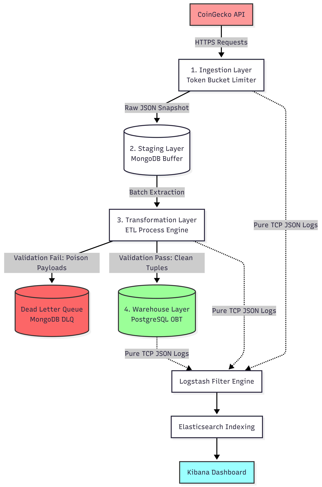
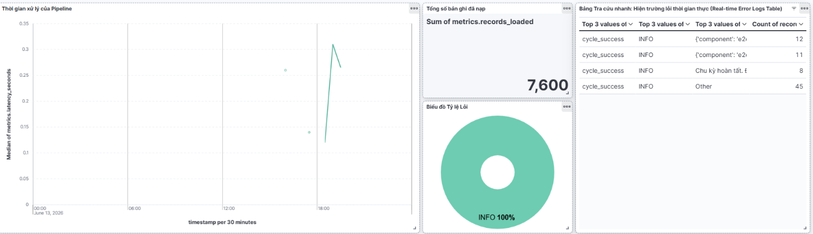

# Crypto Market Data Pipeline with Decentralized Observability

An enterprise-grade, fault-tolerant local data pipeline designed to ingest, process, and monitor real-time cryptocurrency market analytics. This system handles high-frequency financial data from the CoinGecko API, implements a schema-evolution-resistant buffer, guarantees financial-grade exact transformation, and ensures absolute pipeline traceability using the Elastic (ELK) Stack.

---

## 1. Overview

This project simulates a production-ready data platform built on top of a local-first microservices container network. The pipeline is engineered to capture volatile market dynamics without suffering from data loss, API rate-limit bans, or memory starvation. 

By applying robust software engineering practices to modern data workflows, the system achieves strict **Data Idempotency**, high-performance **Bulk Insertions**, and proactive **Centralized Monitoring** tailored for strict Service Level Objectives (SLOs).

---

## 2. Architecture

The platform uses a decoupled, multi-layered architecture to decouple ingestion pressure from core analytical compute layers, isolating faults at every stage of the data lifecycle.



---

## 3. Tech Stack

* **Language & Core Logic**: Python 3.11+ (utilizing `decimal` for precision, `logging.handlers`, and `threading` for rate-limiting)
* **Staging Database**: MongoDB 7.0 (NoSQL Document Store / Schema-Resistant Buffer)
* **Production Warehouse**: PostgreSQL 16 (Relational Database / Analytical Flat Model)
* **Observability Suite**: Elastic Stack 8.12 (Elasticsearch, Logstash, Kibana)
* **Infrastructure Management**: Docker Compose (Infrastructure as Code Layer)
* **Testing Engine**: Pytest + Mongomock (Isolated Unit Testing)

---

## 4. Data Pipeline & Workflow

The ingestion workflow executes end-to-end automated synchronization jobs across five key stages:

1. **Traffic Throttling & Extraction**: The pipeline runs as a continuous background daemon. Before requests touch the endpoint, the `TokenBucketLimiter` validates available slots. If the quota is depleted, worker threads safely sleep until tokens regenerate to protect the API key from rate limits.
2. **Raw Staging Isolation**: Market snapshots (Top 100 assets ordered by market cap) are captured in a single request payload and immediately persisted into MongoDB. This preserves original raw data states and protects downstream failures from breaking the initial web collection line.
3. **Deterministic Financial Parsing**: Data records are unrolled in memory using efficient batch loops. Currency valuations are explicitly cast using Python's `decimal.Decimal` to avoid rounding errors common in native float operations.
4. **Data Idempotency Protection**: To prevent duplicate records upon retries or overlapping execution runs, a unique constraint `(coin_id, extracted_at)` is enforced in the Postgres database. The extraction timestamp is statically derived from the CoinGecko API's `last_updated` field rather than using current client times.
5. **Vectorized Loading & Logging**: Clean data matrices are loaded into PostgreSQL via `psycopg2.extras.execute_values` (Bulk-Upsert) to maximize write throughput. Concurrently, structured JSON telemetry strings are sent over TCP to Logstash to feed real-time Kibana dashboards.

---

## 5. Project Structure

```plaintext
coingecko_pipeline/
├── config/                  # Global Configuration Context
│   └── settings.py          # Validates environment configs and sets up application context
├── docker-compose.yml       # Provisions multi-tier databases and observability tools
├── init.sql                 # Automated database DDL setup schema script
├── logstash/                # Central Logstash filter pipelines
│   └── pipeline/
│       └── logstash.conf
├── src/                     # Codebase Application Core Root
│   ├── crawler/             # Ingestion Utility: crawler_engine.py & coingecko_pipeline.py
│   ├── staging/             # Target Buffer Management: mongo_loader.py
│   ├── etl/                 # Processing Core: transformer.py
│   ├── warehouse/           # Relational Connector: postgres_writer.py
│   └── run_pipeline.py      # Main Orchestrator / Continuous Automated Daemon Service
└── test/                    # Independent Code Quality Verification Suite
    └── test_transformer.py  # Mocked assertions isolating compute from network DBs
```

---

## 6. Setup & Installation

### Prerequisites
Ensure your local host machine has Docker Desktop installed and running.

### 1. Provision Environment Secrets
Clone this repository and create a `.env` file inside the root directory:

```bash
# Clone the repository layout and prepare env file
cp .env.example .env
```

Configure your local credentials securely inside the newly created `.env` file:

```ini
COINGECKO_API_KEY=your_secured_private_coingecko_api_key

MONGO_HOST=localhost
MONGO_PORT=27019
MONGO_USER=cg_staging_admin
MONGO_PASSWORD=your_strong_mongo_password_string
MONGO_DB_NAME=coingecko_staging

POSTGRES_HOST=localhost
POSTGRES_PORT=5439
POSTGRES_USER=cg_warehouse_owner
POSTGRES_PASSWORD=your_strong_postgres_password_string
POSTGRES_DB_NAME=coingecko_warehouse

ELASTIC_PORT=9200
KIBANA_PORT=5601
LOGSTASH_HOST=localhost
LOGSTASH_PORT=5049
```

### 2. Bootstrapping the Virtual Network Stack
Launch all background database nodes and the monitoring engine simultaneously:

```bash
docker compose up -d
```
> [!NOTE]
> The PostgreSQL database automatically instantiates tables and indexes on its first launch via the attached `init.sql` script mounted to `/docker-entrypoint-initdb.d/init.sql`.

### 3. Launching the Data Daemon
Set the root path runtime environment and ignite the continuous analytical execution stream:

```bash
# Set Python path mapping context
$env:PYTHONPATH="."

# Trigger the E2E Automated Orchestrator
python src/run_pipeline.py
```

### 4. Code Verification (Unit Testing)
Execute software quality checks completely disconnected from database infrastructure dependencies:

```bash
pytest test/
```

---

## 7. Observability & SLO Management

Centralized infrastructure dashboards are available at http://localhost:5601 (or your configured Kibana port). SRE metrics monitor system status in real-time to maintain a target SLO of 99.5%:



* **Ingestion Throughput**: Sum aggregation metric monitoring transactional commits over PostgreSQL destination targets.
* **Pipeline Latency Graphs**: Time-series performance metrics tracking computational duration per synchronization cycle.
* **Malformation Pie Charts**: Structural breakdown isolating normal operational notifications from active DLQ (Dead Letter Queue) record streams.

---

## 8. Author

* **Dang Bui Thanh Tung** - Initial Work & Architectural Design - [GitHub Profile](https://github.com/maidkalstit)
* **Contact**:[Gmail](dtung12004@gmail.com) | [LinkedIn Profile](https://www.linkedin.com/in/t%C3%B9ng-%C4%91%E1%BA%B7ng-4a3003391/)
